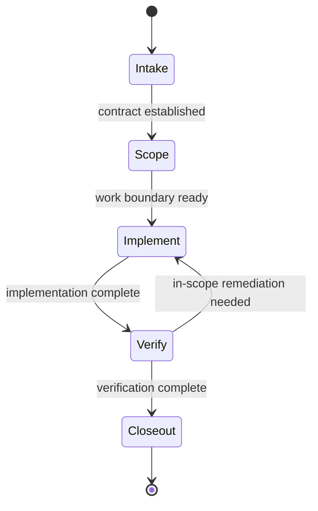

# State Diagram Simplification Proposal for `cs-implement-plan`

## Purpose

This note captures the reasoning for simplifying the state diagram in `skills/cs-implement-plan/SKILL.md` before making any edits.

The goal is not to remove useful structure. The goal is to reduce prompt-level routing entropy so the skill remains easier for an LLM to follow consistently in a coding-agent harness.

## Core Question

The question is not whether the current state diagram is coherent. It is.

The question is which simplifications are justified now, based on structural evidence, without giving up useful visual signal.

My current view is:

- the current diagram is usable
- the happy path is clear
- verification ordering is usefully visible
- one part of the diagram is under-modeled: `HumanInput`
- further flattening should be driven by evidence from real usage, not by aesthetic preference

## Important Constraint

The state diagram is not executable.

A coding agent does not run Mermaid as a formal state machine. It reads the diagram as one signal among several:

- the diagram
- state semantics
- phase structure
- constraints
- budgets
- stop conditions
- closeout contract

This means reliability depends on the whole instruction system, not on the diagram alone.

## Working Heuristic

For prompt-only state modeling, the biggest risk is not raw state count. The more useful metric is routing judgment complexity: how many genuine decisions the LLM must make at each step, and how ambiguous those decisions are.

In practice:

- more states are acceptable if they reduce ambiguity
- more transitions are risky when they require more real judgment per step
- deterministic return-to-caller dispatch is cheaper than ambiguous branching
- exception-path branches are more expensive than happy-path branches
- re-entry behavior is more expensive than forward progression

## Assessment of the Current Diagram

The current diagram has these characteristics:

- `Intake`: 2 outgoing edges
- `Scope`: 2 outgoing edges
- `Implement`: 2 outgoing edges
- `VerifyPlanned`: 2 outgoing edges
- `VerifyBuild`: 2 outgoing edges
- `VerifyTests`: 2 outgoing edges
- `Fix`: 4 outgoing edges
- `HumanInput`: 3 outgoing edges

### What is working

- the major control points are visible
- happy-path sequencing is understandable
- verification is harder to forget
- the diagram helped expose structural contradictions during review

### What remains costly or under-modeled

- `HumanInput` is not modeled well as a state because its resume behavior is cross-cutting
- resume behavior is more complex than the forward path
- the diagram and prose still need synchronization discipline

### What should not be over-read

- `Fix` has four outgoing edges, but most of that is deterministic return-to-caller dispatch, not high routing judgment
- the verification substates carry a real benefit: they make `VerifyPlanned -> VerifyBuild -> VerifyTests` visible and harder to miss

## Design Principle for the Next Simplification

Use the diagram for routing that is both:

- visually helpful
- structurally modeled well enough to be trustworthy

Use prose for:

- cross-cutting pause/resume mechanics
- detailed remediation rules
- detailed escalation rules
- closeout mapping

Prefer the smallest change that is actually supported by evidence.

## Simplification Options

## Option 1: Remove `HumanInput` from the Diagram

### What changes

Treat human input as a cross-cutting pause rule in prose, not as a Mermaid state.

The diagram would no longer show:

- `Intake -> HumanInput`
- `Scope -> HumanInput`
- `Implement -> HumanInput`
- `Fix -> HumanInput`
- `HumanInput -> ...`

Instead, the skill would say in prose that any phase may pause for user input when stop conditions require it.

### Why this helps

- removes the least mechanical state
- removes several non-observable transitions
- removes the one place where the prose already has to patch a gap in the diagram

### What is preserved

- stop conditions
- explicit ask-the-user behavior
- resume rules in prose

### Trade-off

You lose a visual rendering of resume paths.

### Judgment

This is a strong simplification candidate with low downside.

## Option 2: Remove `Fix` from the Diagram

### What changes

Keep remediation inside the `Verify` prose instead of modeling `Fix` as a standalone Mermaid state.

The diagram would no longer show:

- `VerifyPlanned -> Fix`
- `VerifyBuild -> Fix`
- `VerifyTests -> Fix`
- `Fix -> ...`

Instead, the `Verify` phase would continue to specify:

- if a verification step fails
- apply one focused in-scope remediation if appropriate
- re-run only the affected verification step
- stop when the fix-loop budget is exhausted

### Why this helps

- would reduce diagram surface area
- would keep retry behavior where it is already described precisely in prose

### What is preserved

- one-loop remediation behavior
- verification retry constraints
- escalation behavior

### Trade-off

You lose a visible signal that verification failures are handled inside a bounded remediation loop rather than by broad re-entry into implementation.

### Judgment

Defer this change. The current case for removal is weak because `Fix` mostly represents deterministic return-to-caller routing, not a high-judgment branch.

## Option 3: Make the Diagram Phase-Level Only

### What changes

The diagram becomes a direct reflection of the authoritative phase model:

Human input becomes a cross-cutting pause rule in prose.
Detailed verification states become prose inside `Verify`.

### Why this helps

- aligns the diagram directly with the phase model
- eliminates most dual-model tension
- reduces the diagram to coarse control flow only
- keeps only the broadest routing visible

### What is preserved

- authoritative phases
- deterministic verification ordering in prose
- remediation behavior in prose
- closeout mapping

### Trade-off

The diagram no longer visualizes build/test ordering explicitly, even though that ordering was deliberately added to make verification harder to skip at a glance.

That detail remains in the `Verify` phase prose, but prose is less scannable than the current substate flow.

### Judgment

Reject for now. This is pre-emptive simplification without evidence that the current verification substates are causing real routing trouble.

## Comparison

| Option | Structural Support | Lost Detail | Recommended Now |
|---|---|---:|---:|
| Remove `HumanInput` only | Strong | Low | Yes |
| Remove `Fix` only | Weak | Low to Moderate | No, defer |
| Phase-level only | Weak | Moderate | No |

## Recommendation

The best next move is:

1. remove `HumanInput` from the diagram
2. keep `Fix` in the diagram for now
3. keep the verification substates for now
4. gather real usage evidence before considering further collapse

Why:

- `HumanInput` is the one part of the diagram that is demonstrably under-modeled
- `Fix` still carries useful bounded-remediation signal
- `VerifyPlanned -> VerifyBuild -> VerifyTests` is a useful visible commitment
- broader flattening is not yet evidence-based

The resulting design principle is:

- simplify where the diagram is structurally weak
- do not remove visible control flow that is still carrying useful signal
- let future simplifications be driven by observed agent behavior

## What This Proposal Is Not Saying

This proposal is not saying:

- the current diagram is wrong
- the current skill is incoherent
- state modeling is not useful

It is saying:

- one part of the current diagram is clearly weaker than the rest
- not every extra edge is equally risky
- future simplification should be evidence-led

## When Not to Simplify

The current diagram may be worth keeping as-is if:

- real usage shows the model follows it reliably
- the richer visual structure helps more than it hurts
- the added detail materially reduces verification omissions

In that case, the right move would be to keep everything except the under-modeled `HumanInput` handling and gather evidence instead of simplifying further.

## Open Questions for Independent Review

1. Is the current diagram already simple enough for prompt-only use?
2. Does `HumanInput` belong in the Mermaid, or is it better treated as a cross-cutting pause rule?
3. Does `Fix` add useful routing clarity in real runs, or does it prove redundant?
4. Do the verification substates help prevent skipped checks in practice?
5. What real failure modes show up when the skill is used on actual artifacts?

## Suggested Decision Standard

Approve a simplification only if at least one of these is true:

- there is a structural modeling gap that the current diagram does not represent honestly
- real usage shows the current routing creates hesitation, skipping, or confusion
- the simplification preserves load-bearing visible behavior while removing ambiguity

If those tests are not met, prefer gathering real-usage evidence first.
