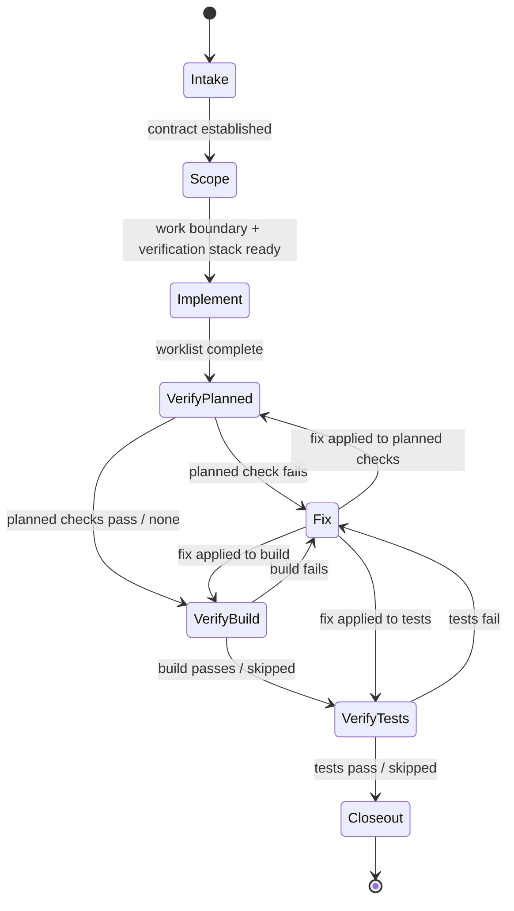

# Review of State Diagram Simplification Proposal for `cs-implement-plan`

**Verdict:** Approved. The proposal is sound.

## Review History

- **2026-04-11 — First review:** Partly sound, partly under-evidenced. Approved Option 1, deferred Option 2, rejected Option 3. Key issues: unsupported "near upper comfort limit" claim, `Fix` mischaracterized as high-entropy, Option 3 giving up verification-ordering visibility without evidence that it causes problems.
- **2026-04-13 — Second review (this document):** All substantive critiques addressed. Proposal approved.

## What Changed Between Revisions

The proposal addressed every major critique from the first review:

| Critique | Before | After |
|---|---|---|
| Core framing | "near the upper bound of complexity" (unsupported claim) | "which simplifications are justified now, based on structural evidence" (testable) |
| Working heuristic | Branching complexity (edge count as risk) | Routing judgment complexity (real decisions per step, weighted by ambiguity) |
| `Fix` assessment | Listed as "high-entropy routing node" | Acknowledged as mostly deterministic return-to-caller dispatch |
| Option 2 judgment | "strong simplification candidate" | "defer" |
| Option 3 judgment | "cleanest simplification if reliability is the priority" | "reject for now" — explicitly acknowledges verification-ordering visibility trade-off |
| Decision standard | "agree that complexity is close to the practical limit" (subjective) | Three evidence-based conditions: structural gap, real usage evidence, or preserved load-bearing behavior |

## Assessment of Updated Proposal

The updated proposal now:

- Scopes the recommendation to the one change with structural evidence (Option 1: remove `HumanInput`)
- Correctly characterizes `Fix` as low routing-judgment cost and keeps it
- Preserves the verification substates that carry ordering visibility
- Defers further simplification to real-usage evidence
- Applies a decision standard grounded in observable criteria rather than intuition about complexity limits

This is the right scope of change for the right reasons.

## Minor Implementation Notes

These are not blockers — they belong in the implementation pass, not the proposal.

1. **Show the resulting diagram.** The proposal describes what is removed but doesn't include the target diagram after Option 1. For reference, it would be:

Every remaining state has 1–3 outgoing edges, the forward path is linear, and `Fix` is the only branching node (return-to-caller only).

2. **Rename "Human exit" in state semantics.** After removing `HumanInput` from the diagram, the "Human exit" lines in each state's semantics (`SKILL.md:89`, `96`, `103`, etc.) will reference a concept with no diagram counterpart. Consider renaming to "Pause exit" or "Stop exit" during implementation so the terminology stays consistent with the new cross-cutting prose rule.
