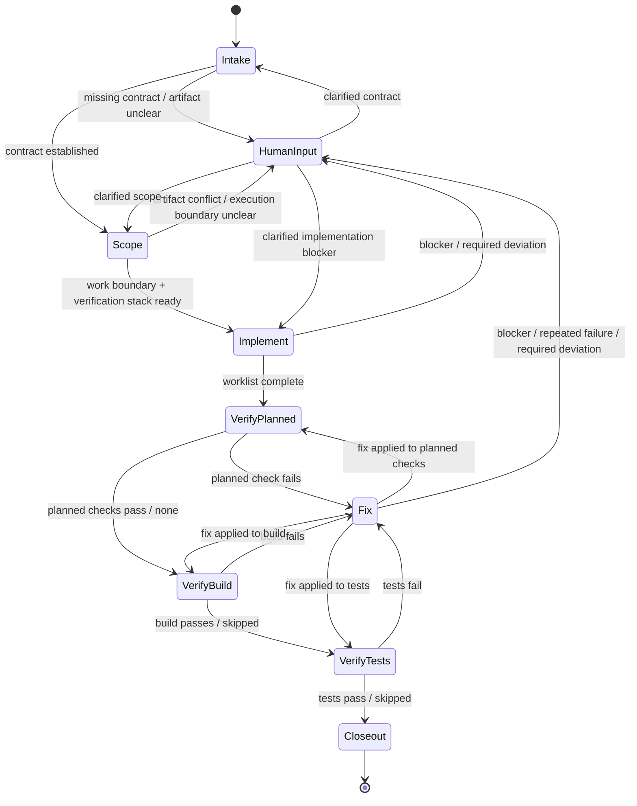

# CS Implement Plan

Implement a feature from planning artifacts. Preserve the artifact contract from `hand-off.md`, `plan.md`, and `spec.md`, then drive execution through explicit states and deterministic verification.

`hand-off.md` is the preferred entry point because it is the execution-facing contract. `plan.md` is an acceptable fallback. `spec.md` alone is usually insufficient to implement safely.

## When to Use

Use this for reviewed implementation artifacts when you want explicit state-based verification ordering, deterministic stop conditions, and a structured closeout contract.

If the user only has `spec.md`, route back to planning unless they explicitly want you to derive an implementation plan first.

## Inputs

Before starting, gather:

1. The primary artifact path or text the user supplied.
2. Any explicit scope limits or focus areas from the user.
3. Any referenced sibling artifacts.
4. Any repo-local implementation guidance if the artifact points to it.
5. Any user-pinned verification commands if they want build/test behavior constrained.

Missing-input behavior:

- If the primary input is `spec.md` only, stop and ask for `plan.md` or `hand-off.md` unless the user explicitly wants planning work.
- If the input is unstructured text, ask for a concrete artifact or path unless the user clearly wants ad hoc implementation.
- If artifacts conflict materially on intent, approach, or fixed decisions, stop and surface the conflict before coding.

## Output Contract

At closeout, report in this shape:

- `Implementation status`: `Completed`, `Blocked`, or `Needs human input`
- `Artifact alignment`: whether the implementation matches `hand-off.md`, `plan.md`, and `spec.md`
- `Verification`: each step marked `Passed`, `Failed`, `Skipped`, or `Blocked`
- `Deviations and risks`: explicit list, even if empty
- `Next action`: `Ready for review`, `Needs user decision`, or `Blocked by environment`

Do not imply completion if any required verification step was skipped or blocked. State that explicitly.

## State Model

The phases below are the execution driver. The state model above is a routing reference: `VerifyPlanned`, `VerifyBuild`, `VerifyTests`, and `Fix` are substeps inside the `Verify` phase, and `HumanInput` represents any point where execution pauses for user input.

## State Semantics

### Intake

- Entry: user supplied an artifact path or implementation request
- Actions: identify artifact type, load sibling artifacts, establish the primary contract
- Success exit: primary artifact and required siblings are loaded
- Human exit: artifact type cannot be determined safely, or only `spec.md` exists

### Scope

- Entry: execution contract established
- Actions: extract fixed decisions, ordered work, likely starting files, and verification expectations
- Success exit: work boundary and verification stack are explicit enough to start coding
- Human exit: artifacts conflict or a load-bearing requirement is still missing

### Implement

- Entry: execution-ready work boundary exists
- Actions: execute the ordered worklist without revisiting fixed decisions
- Success exit: in-scope implementation work is complete enough to verify
- Human exit: completing the work would require a material deviation from the artifacts

### VerifyPlanned

- Entry: implementation work is complete, or a targeted fix needs re-verification
- Actions: run artifact-specified checks first
- Success exit: explicit planned checks pass, or none exist
- Fix exit: a planned verification step fails and an in-scope remediation path is apparent
- Human exit: the check cannot run, or repeated failure suggests the plan or environment is wrong

### VerifyBuild

- Entry: planned checks are complete or not applicable
- Actions: run one repo-standard build command when a high-confidence command is known and relevant
- Success exit: build passes, or build is explicitly `Skipped` as not relevant
- Fix exit: build fails and the failure appears in scope
- Human exit: build command is ambiguous, environment-blocked, or the fix-loop budget is exhausted

### VerifyTests

- Entry: build passed or is not applicable
- Actions: run one repo-standard test command when a high-confidence command is known and relevant
- Success exit: tests pass, or tests are explicitly `Skipped` as not relevant
- Fix exit: tests fail and the failure appears in scope
- Human exit: test command is ambiguous, environment-blocked, or the fix-loop budget is exhausted

### Fix

- Entry: one verification state failed with an apparent in-scope remediation
- Actions: make the narrowest fix that addresses the observed failure, then return to the affected verification state
- Success exit: one focused remediation completed
- Human exit: the next step would require scope expansion, plan drift, or the fix-loop budget would be exceeded

### Closeout

- Entry: implementation and applicable verification are complete
- Actions: report status against artifacts and verification states
- Success exit: final implementation status is explicit

## Deterministic Verification Policy

Verification order is fixed:

1. Run artifact-specified verification steps from `hand-off.md` or `plan.md`.
2. If the repository exposes a clear standard build command and it is relevant, run it once.
3. If the repository exposes a clear standard test command and it is relevant, run it once.

Rules:

- Prefer artifact-specified commands over repo-standard commands.
- If build/test commands are ambiguous, prefer the repo's documented top-level command. If none is clearly supported, mark that step `Blocked` or `Skipped` with the reason rather than guessing.
- Respect the fix-loop budget below for any verification failure.
- Re-run only the directly affected verification step after a fix unless the artifacts explicitly call for broader reruns.
- If the repo clearly has both a standard build and test command, do not stop at "implemented"; carry through to those checks.

## Delegation Contract

If you delegate implementation or verification subwork, brief the sub-agent with:

- the current state
- the current work item or failure being addressed
- relevant artifact excerpts
- fixed decisions that must not be reopened
- files, commands, and facts already checked
- the exact question or task-local objective
- the evidence budget
- the expected output shape

Do not delegate artifact rediscovery. Validate the returned contract before depending on it.

## Stop Conditions

Stop and surface the issue instead of continuing when:

- artifacts conflict materially
- required implementation context is missing
- completing the next step would require reopening a fixed decision
- the same unresolved work item consumes 3 consecutive exploration or verification actions
- the fix-loop budget is exhausted for a verification failure
- a required build or test step is blocked by environment, dependency, or command ambiguity

<constraints scope="global">
- Prefer explicit artifact identity over inference. Use YAML frontmatter `artifact: hand-off|plan|spec` first, filename second, and content heuristics only as a fallback.
- `hand-off.md` is the primary execution contract. `plan.md` describes the implementation approach. `spec.md` defines the intended behavior. If they conflict, do not guess: `spec.md` wins on intent, `plan.md` wins on implementation approach, and `hand-off.md` wins on execution priority and focus.
- Do not revisit fixed decisions from `hand-off.md` unless the artifacts conflict or the codebase makes the decision impossible to implement as written.
- If required implementation context is missing, ask or stop. Do not silently invent requirements.
- State transitions are real control points. Do not skip a verification state silently because the implementation "looks fine."
- Keep verification ordering explicit. Planned checks come first, then repo-standard build, then repo-standard tests when applicable.
- Record any skipped or blocked verification step explicitly in the closeout.
- If you delegate implementation or verification subwork, do not make the sub-agent rediscover the artifacts.
</constraints>

<budget>
- Intake: max 3 verification actions to identify the artifact type and load required sibling artifacts.
- Step resolution: if a worklist item requires facts not present in the artifacts, spend at most 3 targeted verification actions to resolve that step before surfacing a blocker.
- Verification: run each planned verification step once each, then one repo-standard build and one repo-standard test when high-confidence commands exist and are relevant.
- Fix loops: at most 1 focused remediation loop per failed verification state before surfacing the blocker.
</budget>

<phase name="Intake">

<goal>
Identify the input artifact and establish the execution contract.
</goal>

<procedure>
1. If the user supplied a file path, inspect that file first.
2. Determine artifact type in this order:
   - YAML frontmatter `artifact`
   - filename (`hand-off.md`, `plan.md`, `spec.md`)
   - content structure
3. Apply the entry rules:
   - If `artifact: hand-off`, use it as the primary contract and load referenced `plan.md` and `spec.md`.
   - If `artifact: plan`, use it as the primary contract, load referenced `spec.md`, and load `hand-off.md` if present.
   - If `artifact: spec` only, stop and ask for `plan.md` or `hand-off.md` unless the user explicitly wants you to derive an implementation plan first.
   - If the input is unstructured text, ask for the missing artifact or a concrete path unless the user clearly wants ad hoc implementation.
4. Record which artifact is primary and what supporting artifacts were loaded.
5. If the primary artifact is `hand-off.md`, verify it contains these expected sections:
   - `Execution scope`
   - `Inputs`
   - `Fixed decisions`
   - `Ordered worklist`
   - `Verification expectations`
   - `Watch-fors and risks`
   - `Unresolved items`
   Flag any missing sections before proceeding. Missing sections are a risk to manage, not a reason to silently skip them.
</procedure>

<gate>
- Primary artifact type identified.
- Required supporting artifacts loaded or explicitly found missing.
- Execution contract established before coding begins.
</gate>

</phase>

<phase name="Scope">

<goal>
Translate the planning artifacts into an execution-ready work boundary and verification stack.
</goal>

<procedure>
1. From `hand-off.md` or `plan.md`, extract and record:
   - execution scope
   - inputs
   - fixed decisions
   - ordered worklist
   - watch-fors and risks
   - verification expectations
   - unresolved items
2. If you entered through `plan.md` and there is no `hand-off.md`, derive a minimal execution checklist and state any assumptions you had to make.
3. Identify the smallest set of files, types, and tests needed to start implementation.
4. Build the verification stack in this order:
   - artifact-specified checks
   - repo-standard build command if discoverable with high confidence
   - repo-standard test command if discoverable with high confidence
5. For each verification step, record:
   - source: `artifact-specified` or `repo-standard`
   - execution intent: `Run`, `Skip`, or `Block pending clarification`
6. If a load-bearing fixed decision conflicts with code reality before implementation starts, stop and surface it rather than drifting.
</procedure>

<gate>
- Execution scope identified.
- Fixed decisions identified.
- Starting file/type/test set identified.
- Verification stack identified and classified.
</gate>

</phase>

<phase name="Implement">

<goal>
Execute the reviewed plan without drifting from the artifacts.
</goal>

<constraints>
- Follow `hand-off.md` when present. When absent, follow `plan.md` conservatively.
- Do not improvise across scope boundaries.
- If you encounter an ambiguity or want to deviate from the plan:
  - state what you already know
  - assess whether the deviation is compatible with the artifacts
  - decide, or surface the blocker instead of guessing
- Before executing a worklist item that touches a surface flagged in `Watch-fors and risks`, re-read that risk entry and decide whether it applies to the current change. If it does, state how you are mitigating it.
- Surface progress at natural work boundaries for multi-step implementation, typically after a completed worklist item, before delegation, or when shifting to verification. Keep the update brief: what was done, what is next, and whether anything is blocked.
- If a single worklist item takes 5 consecutive tool actions without reaching a natural progress boundary, give a brief status update before continuing. State what you are doing, why the item is taking longer than usual, and what remains.
- If you spend 3 consecutive exploration or verification actions on the same unresolved worklist item without closing the question, stop and tell the user what is blocking progress, what you already checked, and whether you can continue autonomously.
</constraints>

<procedure>
1. Execute the work in the artifact order.
2. Re-read the relevant artifact section before changing direction.
3. If a step depends on a missing fact, spend the targeted step budget to resolve it.
4. If still unclear after the step budget, stop and surface the blocker.
5. When implementation work is complete, transition explicitly into verification rather than concluding from code inspection alone.
</procedure>

<gate>
- Planned implementation work completed, or
- blocker surfaced with the exact missing fact or decision.
</gate>

</phase>

<phase name="Verify">

<goal>
Verify the implementation against the artifacts and repository behavior using explicit verification states.
</goal>

<constraints>
- Before starting verification, tell the user which verification states you are about to run when there is more than one meaningful step.
- If a verification step fails, surface the failure promptly instead of investigating silently.
- After surfacing a failure, spend at most 2 targeted diagnostic reads before deciding whether the issue is an in-scope fix, a deviation to report, or a blocker to escalate.
- If a verification failure clearly points to an in-scope fix, you may fix it and re-run only the directly affected verification state, subject to the fix-loop budget below.
- Do not claim that build or test verification is not applicable unless you checked whether a high-confidence repo-standard command exists.
</constraints>

<procedure>
1. Use the verification stack classified during `Scope`. Do not re-discover commands that `Scope` already marked `Skip` or `Block pending clarification` unless new information emerged during `Implement`.
2. If re-entering `Verify` after a human-resolved blocker that originated in `Fix`, resume from the verification state that triggered the escalation unless `Implement` changed the verification scope materially.
3. Run `VerifyPlanned`:
   - execute the verification steps called for by `hand-off.md` or `plan.md`
   - record `Passed`, `Failed`, `Skipped`, or `Blocked` for each step
4. Run `VerifyBuild`:
   - if a high-confidence repo-standard build command exists and is relevant, run it once
   - otherwise mark build verification as `Skipped` if not relevant, or `Blocked` if it should run but cannot
5. Run `VerifyTests`:
   - if a high-confidence repo-standard test command exists and is relevant, run it once
   - otherwise mark test verification as `Skipped` if not relevant, or `Blocked` if it should run but cannot
6. If any verification state fails:
   - determine whether one focused in-scope remediation is apparent
   - if yes, enter `Fix`, apply the narrowest fix, and re-run only the affected state, subject to the fix-loop budget below
   - if not, surface the blocker
7. Check that the implementation still matches the intent in `spec.md`.
8. Record any deviations, skipped checks, missing tests, or residual risks.
</procedure>

<gate>
- Verification executed or explicit verification blocker stated.
- Build and test states either passed, failed, skipped, or were explicitly blocked with reasons.
- Deviations from the artifacts, if any, surfaced explicitly.
</gate>

</phase>

<phase name="Closeout">

<goal>
Report implementation status in terms of the planning artifacts and verification states.
</goal>

<procedure>
1. Summarize what was implemented.
2. Translate execution outcomes to the output contract terms:
   - successful completion -> `Completed`
   - paused for user input -> `Needs human input`
   - unresolved blocker -> `Blocked`
3. State whether the implementation matches:
   - `hand-off.md`
   - `plan.md`
   - `spec.md`
4. List verification outcomes using the output contract statuses.
5. List any deviations, blockers, or follow-up work.
6. State one next action:
   - `Ready for review`
   - `Needs user decision`
   - `Blocked by environment`
</procedure>

<gate>
- Final status reported against the planning artifacts.
- Verification states reported explicitly.
- Any deviation or blocker stated explicitly.
</gate>

</phase>
